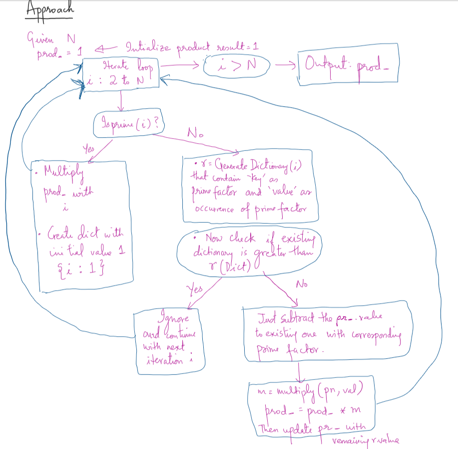

# Algorithm:

**Some Defined function**
1. multiply(pn,v) which take pn as key and v as values from the dict()

2. isprime(num) which to check whether this num is prime or not

3. pf_dict(num) which is used to generate factor of num in dictionary where __key__ as prime factor and __value__ as number of occurrences for that prime factor

# Output

